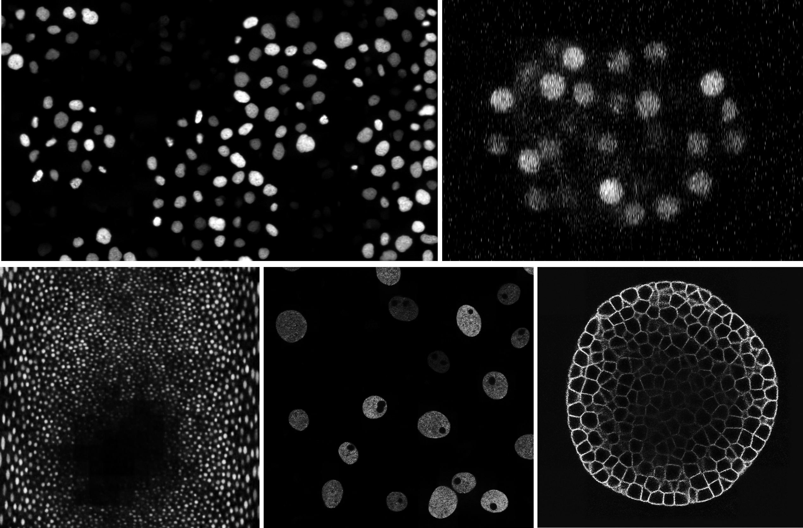
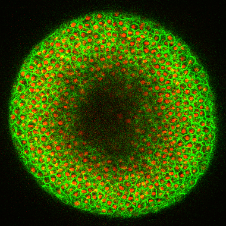
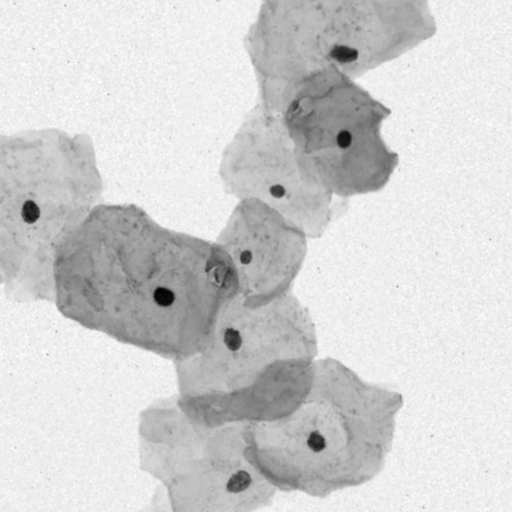
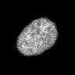

# Denoising Diffusion Probabilistic Models for Generation of Realistic Fully-Annotated Microscopy Image Data Sets
<br>
This repository contains code to simulated 2D/3D cellular structures and synthesize corresponding microscopy image data based on Denoising Diffusion Probabilistic Models (DDPM).
Sketches are generated to indicate cell shapes and structural characteristics, and they serve as a basis for the diffusion process to ultimately allow for the generation of fully-annotated microscopy image data sets without the need for human annotation effort.
Generated data sets are available at <a href=https://osf.io/dnp65/>OSF</a> and the article is available at <a href=https://journals.plos.org/ploscompbiol/article?id=10.1371/journal.pcbi.1011890>PLOS CB</a>.
To access the trained models and get a showcase of the fully-simulated data sets, please visit to our <a href=https://transfer.lfb.rwth-aachen.de/CellDiffusion>website</a> (work in progress).<br><br>
<span style="white-space:nowrap"><br>
<span style="white-space:nowrap"></span></span><br>
<em>Exemplary synthetic samples from our experiments</em><br><br><br>


If you are using code or data, please cite the following work:
```
@article{eschweiler2024celldiffusion,
  title={Denoising diffusion probabilistic models for generation of realistic fully-annotated microscopy image datasets},
  author={Eschweiler, Dennis and Yilmaz, R{\"u}veyda and Baumann, Matisse and Laube, Ina and Roy, Rijo and Jose, Abin and Br{\"u}ckner, Daniel and Stegmaier, Johannes},
  journal={PLOS Computational Biology},
  volume={20},
  number={2},
  pages={e1011890},
  year={2024}
}
```
<br><br><br>
We provide Jupyter Notebooks that give an overview of how to preprocess your data, train and apply the image generation process. The following gives a <em>very brief</em> overview of the general functionality, for more detailed examples we refer to the notebooks. 

## Data Preparation
The presented pipelines require the hdf5 file format for processing. Therefore, each image file has to be converted to hdf5, which can be done by using `utils.h5_converter.prepare_images`. Once all files have been converted, a list of those files has to be stored as a csv file to make them accessible by the processing pipelines. This can be done by using `utils.csv_generator.create_csv`. A more detailed explanation is given in `jupyter_preparation_script.ipynb`.


## Diffusion Model Training and Application
To use the proposed pipeline to either train or apply your models, make sure to adapt all parameters in the pipeline files `models/DiffusionModel3D` or `models/DiffusionModel2D`, and in the training script `train_script.py` or application script `apply_script_diffusion.py`. Alternatively, all parameters can be provided as command line arguments. A more detailed explanation is given in `jupyter_train_script.ipynb` and `jupyter_apply_script.ipynb`.


## Simulation of Cellular Structures and Sketch Generation
Since the proposed approach is working in a very intuitive manner, sketches can generally be created in any arbitrary way. We mainly focused on using and adapting simulation techniques proposed in <a href='https://journals.plos.org/plosone/article?id=10.1371/journal.pone.0260509'>3D fluorescence microscopy data synthesis for segmentation and benchmarking</a>. Nevertheless, the functionality used in this work can be found in `utils.synthetic_cell_membrane_masks` and `utils.synthetic_cell_nuclei_masks` for cellular membranes and nuclei, respectively.

## Processing Times and Hardware Requirements
Due to the layout and working principle of the computation cluster we used, determining precise hardware requirements was difficult. 
The used hardware offered varying hardware capabilities, including GPUs ranging from GTX 1080 to RTX 6000.
Nevertheless, the following should give some brief indication of the specifications needed to run the presented pipelines. 

Training times varied between one day for 2D models to roughly a week for 3D models, requiring 2-8 GB of RAM and 4-8 GB of GPU memory.
Prediction times were highly varying, as they are influences by the choice of the backward starting point $t_\mathrm{start}$ and the total image size.
For the proposed starting point $t_\mathrm{start}=400$, image generation times ranged between less than a minute for 2D image data of size 1024x1024 pixel to roughly one hour for image data of size 512x512x180 voxel or 1700x2450x13 voxel.
Memory requirements were similarly varying, ranging between 2-80 GB of RAM and 4-8 GB of GPU memory.
